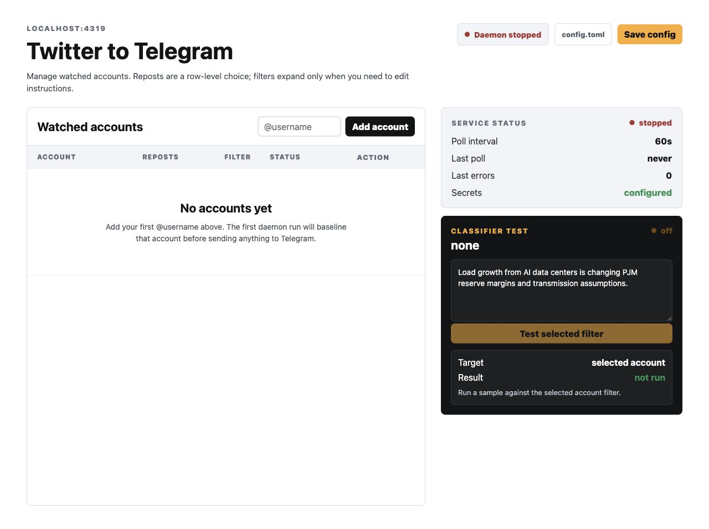

# Twitter to Telegram Notifications

[](https://www.python.org/)
[](https://www.sqlite.org/)
[](https://developer.x.com/)
[](https://core.telegram.org/bots/api)

I made this for my homelab mini PC because I wanted more control over X/Twitter notifications. The current notification system is pretty barebones for power users, especially people watching social signals for markets. I have found this useful so far and wanted to share it. Please reach out, open issues, or send PRs if you want to add functionality. Thank you.

Self-hosted X/Twitter to Telegram notifications for a mini PC or homelab.

No scraping. No X password. No backlog spam. The daemon polls configured X accounts with the official API, stores durable state in SQLite, and forwards new qualifying posts to a Telegram chat or channel.



## What you get

- A local web console for adding accounts, removing accounts, toggling reposts, and editing per-account filter instructions.
- An empty first-run config, so you can start the web UI first and add accounts when you are ready.
- First-run baselining so old posts do not flood Telegram.
- Clean Telegram messages with account links, Open on X links, expanded shared links, quotes, reposts, polls, photos, and video fallbacks.
- Reply exclusion globally and repost controls per account.
- Optional topic filtering for noisy accounts through Hermes, xAI/Grok, or any OpenAI-compatible endpoint.
- A small Python daemon that runs comfortably under `systemd` on a low-resource Linux box.
- Config reload on every poll, so account changes made in the web UI are picked up without restarting the daemon.
- A SQLite pending-delivery queue, so Telegram outages do not force repeated X reads for the same fetched tweet.

## Using this with an AI agent

The README keeps commands short on purpose. For machine-specific setup, clone the repo and open it in Codex or another repo-aware coding agent so it can inspect the files directly.

Useful things to ask:

- "Adapt the systemd service for my mini PC paths and Linux distro."
- "Configure this repo to call my local Hermes endpoint for topic filtering."
- "Help me add these X/Twitter accounts and filter instructions to `config.toml`."
- "Walk me through Telegram channel setup and verify my chat ID format."
- "Run a dry-run safely without changing my production SQLite state."
- "Add a new classifier provider or deployment option."

## Built for homelabs

The intended setup is simple:

1. Run the notifier daemon on a mini PC.
2. Keep secrets in `/etc/twitter-tg-notifs/.env`.
3. Manage accounts from the localhost web console.
4. Optionally run Hermes next to it for local relevance filtering.
5. Let Telegram be the delivery surface on your phone, desktop, or channel.

The web UI is localhost-only by default. On a headless mini PC, tunnel it from your laptop:

```bash
ssh -L 4319:127.0.0.1:4319 mini-pc
/opt/twitter-tg-notifs/.venv/bin/twitter-tg-notifs web \
  --config /etc/twitter-tg-notifs/config.toml \
  --env-file /etc/twitter-tg-notifs/.env \
  --state-db /var/lib/twitter-tg-notifs/state.sqlite3 \
  --no-open
```

Then open `http://127.0.0.1:4319`.

## Hermes and local filtering

Noisy accounts can be filtered before Telegram delivery. The app sends a normalized tweet payload plus the account's filter instructions to a classifier and only sends the Telegram message when the classifier returns `send: true`.

Local Hermes-style endpoint:

```http
POST http://127.0.0.1:8787/classify
```

Expected strict JSON:

```json
{
  "send": true,
  "confidence": 0.86,
  "matched_topics": ["AI data center electricity demand"],
  "reason": "The post discusses electricity demand growth from AI infrastructure."
}
```

Example config:

```toml
[classifier]
provider = "http_json"
http_json_url = "http://127.0.0.1:8787/classify"
fallback_provider = "xai"

[[accounts]]
username = "noisy_account"
include_reposts = true

[accounts.topic_filter]
enabled = true
instructions = "Send only posts about nuclear power, AI data center electricity demand, coal exports, or utility capex. Skip broad market commentary."
confidence_threshold = 0.70
on_filter_error = "skip"
```

Provider options:

- `none`: no filtering.
- `http_json`: local endpoint such as Hermes.
- `xai`: hosted xAI/Grok with `XAI_API_KEY`.
- `openai_compatible`: any OpenAI-compatible `/chat/completions` endpoint with optional `OPENAI_API_KEY`.

The classifier only decides relevance. It does not rewrite or summarize the tweet.

## Quick start

```bash
git clone https://github.com/ajsathyan/twitter-to-telegram-notifications.git
cd twitter-to-telegram-notifications

python3.11 -m venv .venv || python3 -m venv .venv
. .venv/bin/activate
python -m pip install -U pip
python -m pip install -e .

cp examples/config.toml config.toml
cp examples/.env.example .env
chmod 600 .env
```

Edit `.env`:

```bash
X_BEARER_TOKEN=replace-with-x-api-bearer-token
TELEGRAM_BOT_TOKEN=replace-with-telegram-bot-token
TELEGRAM_CHAT_ID=-1001234567890
```

Open the local console:

```bash
twitter-tg-notifs web --config config.toml --env-file .env --state-db data/state.sqlite3
```

The example config starts with no accounts. Add accounts in the web console, set reposts Yes/No per row, and expand an account only when you want topic-filter instructions. The daemon reloads config on each poll, so saved account changes are picked up automatically.

Validate config and secrets:

```bash
twitter-tg-notifs validate-config --config config.toml --env-file .env
```

Baseline once without sending old posts:

```bash
twitter-tg-notifs run --config config.toml --env-file .env --state-db data/state.sqlite3 --once
```

Run continuously:

```bash
twitter-tg-notifs run --config config.toml --env-file .env --state-db data/state.sqlite3
```

## Mini PC install

On Ubuntu/Debian:

```bash
sudo apt update
sudo apt install -y git python3 python3-venv

sudo mkdir -p /opt/twitter-tg-notifs /etc/twitter-tg-notifs /var/lib/twitter-tg-notifs
sudo chown "$USER":"$USER" /opt/twitter-tg-notifs

git clone https://github.com/ajsathyan/twitter-to-telegram-notifications.git /opt/twitter-tg-notifs
cd /opt/twitter-tg-notifs

python3 -m venv .venv
.venv/bin/python -m pip install -U pip
.venv/bin/python -m pip install -e .

sudo cp examples/config.toml /etc/twitter-tg-notifs/config.toml
sudo cp examples/.env.example /etc/twitter-tg-notifs/.env
sudo chmod 600 /etc/twitter-tg-notifs/.env
```

Edit `/etc/twitter-tg-notifs/config.toml` and `/etc/twitter-tg-notifs/.env`, then install the service:

```bash
sudo useradd --system --home /opt/twitter-tg-notifs --shell /usr/sbin/nologin twitter-tg-notifs || true
sudo chown -R twitter-tg-notifs:twitter-tg-notifs /var/lib/twitter-tg-notifs

sudo cp deploy/twitter-tg-notifs.service /etc/systemd/system/twitter-tg-notifs.service
sudo systemctl daemon-reload
sudo systemctl enable --now twitter-tg-notifs

sudo systemctl status twitter-tg-notifs
sudo journalctl -u twitter-tg-notifs -f
```

## Windows 11 mini PC install

The Python code is cross-platform. On Windows 11, use Task Scheduler instead of `systemd`.

PowerShell setup:

```powershell
git clone https://github.com/ajsathyan/twitter-to-telegram-notifications.git C:\twitter-tg-notifs
cd C:\twitter-tg-notifs

py -3.11 -m venv .venv
.\.venv\Scripts\python.exe -m pip install -U pip
.\.venv\Scripts\python.exe -m pip install -e .

New-Item -ItemType Directory -Force C:\ProgramData\twitter-tg-notifs
Copy-Item examples\config.toml C:\ProgramData\twitter-tg-notifs\config.toml
Copy-Item examples\.env.example C:\ProgramData\twitter-tg-notifs\.env
notepad C:\ProgramData\twitter-tg-notifs\.env
notepad C:\ProgramData\twitter-tg-notifs\config.toml
```

Open the local console:

```powershell
.\.venv\Scripts\twitter-tg-notifs.exe web `
  --config C:\ProgramData\twitter-tg-notifs\config.toml `
  --env-file C:\ProgramData\twitter-tg-notifs\.env `
  --state-db C:\ProgramData\twitter-tg-notifs\state.sqlite3
```

Register the always-on daemon as a scheduled task from an elevated PowerShell window:

```powershell
powershell -ExecutionPolicy Bypass -File .\deploy\windows-task.ps1
Start-ScheduledTask -TaskName TwitterTgNotifs
Get-ScheduledTask -TaskName TwitterTgNotifs
Get-Content C:\ProgramData\twitter-tg-notifs\logs\daemon-*.log -Tail 80
```

## Configuration model

Non-secret settings live in TOML:

```toml
[polling]
interval_seconds = 60
timezone = "America/New_York"

[x]
exclude_replies = true
default_include_reposts = true

[[accounts]]
username = "account_a"

[[accounts]]
username = "account_b"
include_reposts = false
```

Secrets stay in `.env` or environment variables. The app masks secrets in CLI output.

Local files to keep private:

- `.env`: API tokens and Telegram chat ID.
- `data/*.sqlite3`: watched account state, sent tweet IDs, pending deliveries, classifier decisions, and poll status.

## Useful commands

```bash
twitter-tg-notifs validate-config --config config.toml --env-file .env
twitter-tg-notifs web --config config.toml --env-file .env --state-db data/state.sqlite3
twitter-tg-notifs run --config config.toml --env-file .env --once
twitter-tg-notifs dry-run --config config.toml --env-file .env --state-db data/test.sqlite3
```

Dry-run does not send Telegram messages and does not mark tweets as sent. By default it uses a temporary copy of the state DB, so it does not change production state. Pass `--write-state` only when you explicitly want dry-run to advance the real SQLite state.

## Development

```bash
python -m pip install -e ".[dev]"
python -m pytest -q
```

The test suite covers config validation, secret masking, X response normalization, first-run baseline behavior, dedupe, reply/repost controls, Telegram HTML escaping, message formatting, classifier adapters, web UI config edits, and CSRF protection.
